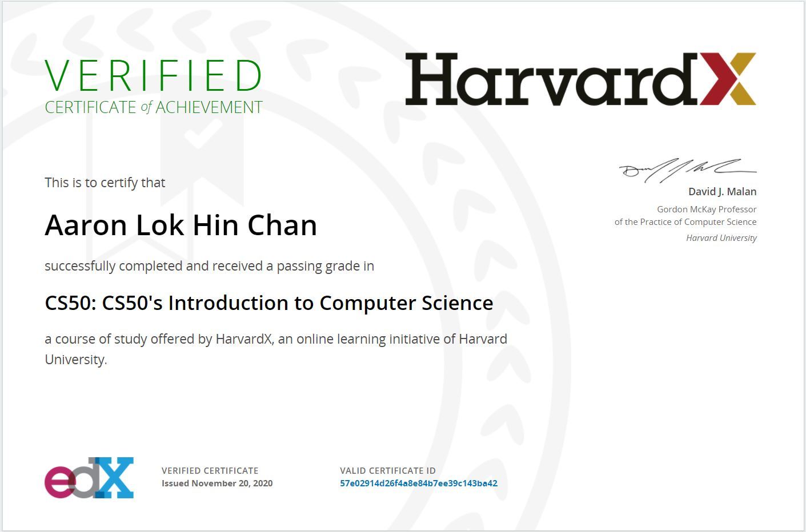

# Harvard University's CS50: Introduction to Computer Science 

<h1><a href='https://cs50.harvard.edu/x/2020/syllabus/#syllabus'> Syllabus</a></h1>

Introduction to the intellectual enterprises of computer science and the art of programming. This course teaches students how to think algorithmically and solve problems efficiently. Topics include abstraction, algorithms, data structures, encapsulation, resource management, security, and software engineering. Languages include C, Python, and SQL plus students’ choice of: HTML, CSS, and JavaScript (for web development); Java or Swift (for mobile app development); or Lua (for game development). Problem sets inspired by the arts, humanities, social sciences, and sciences. Course culminates in a final project. Designed for concentrators and non-concentrators alike, with or without prior programming experience. Two thirds of CS50 students have never taken CS before. Among the overarching goals of this course are to inspire students to explore unfamiliar waters, without fear of failure, create an intensive, shared experience, accessible to all students, and build community among students.

https://courses.edx.org/courses/course-v1:HarvardX+CS50+X/dfface6ffc1c43e6882a245c945f7feb/

## Table Of Contents

- [Problem Set 1: C](/C_Problem_Sets/ps1/) - <a href='https://cs50.harvard.edu/x/2020/psets/1/'> Assignments 1</a>
  * [mario](/C_Problem_Sets/ps1/)
  * [cash](/C_Problem_Sets/ps1/)
  
- [Problem Set 2: Arrays](/C_Problem_Sets/ps2/) - <a href='https://cs50.harvard.edu/x/2020/psets/2/'> Assignments 2</a> 
  * [caesar](/C_Problem_Sets/ps2/)
  * [readability](/C_Problem_Sets/ps2/)
    
- [Problem Set3: Algorithms](/C_Problem_Sets/ps3/) - <a href='https://cs50.harvard.edu/x/2020/psets/3/'> Assignments 3</a> 
  * [plurality](/C/pset3/plurality)
  * [runoff](/C/pset3/runoff)

- [Problem Set 6: Python](/Python_Problem_Sets/ps6/) - <a href='https://cs50.harvard.edu/x/2020/psets/6/'> Assignments 6</a>
  * [mario](/Python_Problem_Sets/ps6/)
  * [cash](/Python_Problem_Sets/ps6/)
  * [credit](/Python_Problem_Sets/ps6/)
  * [readability](/Python_Problem_Sets/ps6/)
  * [dna](/Python_Problem_Sets/ps6/)

- [Problem Set 7: SQL](/Python_Problem_Sets/ps7/) - <a href='https://cs50.harvard.edu/x/2020/psets/7/'> Assignments 7</a>
  * [movies](/Python_Problem_Sets/ps7/)
  * [houses](/Python_Problem_Sets/ps7/)

- [Problem Set 8: Information](/Python_Problem_Sets/ps8/) - <a href='https://cs50.harvard.edu/x/2020/tracks/web/'> Web Tracks</a>
  * [Website](/Python_Problem_Sets/ps8/)
  
- [Web Track Project](/Python_Problem_Sets/web_track/) - <a href='https://cs50.harvard.edu/x/2020/tracks/web/'> Web Tracks</a>
  * [Stockmarket Trading Simulator](/Python_Problem_Sets/web_track/) - <a href='https://cs50x-stockmarket.herokuapp.com/login'> Stockmarket Trading Simulator</a> 
  
- [Final Project: Stocks Dashboard](https://cs50-stocks-dashboard.herokuapp.com/)
   * Financial stocks dashboard created using Plotly chart libraries, and Python Flask framework. Used for analyzing stock trends, and company information.
    
   
- Other Flask Projects:
  * <a href='https://aaron-test-application.herokuapp.com/'>Bookstore Search</a>: Search for any book to see related information, ratings and reviews. Created with Flask framework. 
    
### Final Certificate:
(https://courses.edx.org/certificates/57e02914d26f4a8e84b7ee39c143ba42)

### DISCLAIMER:
 [**Academic Honesty**](https://docs.cs50.net/2016/fall/syllabus/cs50.html#academic-honesty).
